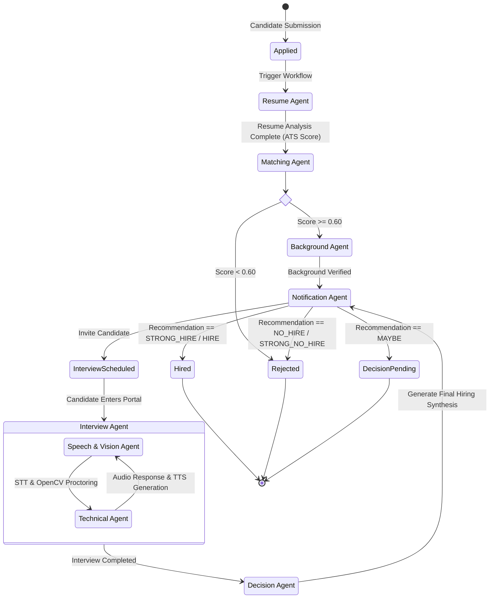

# TalentFlow-AI Agent Workflow & Pipeline

## 1. Overview & Pipeline Flow Diagram

TalentFlow-AI executes automated candidate evaluation using a stateful **LangGraph Orchestrator** driving 8 specialized AI agents. The workflow is deterministic, event-driven, and maintains a clean audit trial in Cloud Firestore.

---

## 2. Agent Responsibilities & Specs

### 2.1 Orchestrator Agent (`agents/orchestrator/`)
- **Role**: Pipeline supervisor and state coordinator using LangGraph.
- **Responsibilities**:
  - Maintains execution context (`State` object).
  - Routes workflow transitions based on evaluation scores.
  - Handles retry logic and exception fallback states.
- **Primary LLM**: Direct state machine code + Groq `llama-3.3-70b` for dynamic routing fallback.

---

### 2.2 Resume Agent (`agents/resume_agent/`)
- **Role**: Candidate profile & resume parsing engine.
- **Responsibilities**:
  - Extracts structured candidate text from PDF/DOCX uploads.
  - Identifies technical skills, career timeline, education history, and achievements.
  - Calculates ATS score (0-100) and detects keyword deficiencies.
- **Primary LLM**: Groq `llama-3.1-8b` (Fast, structured JSON output).

---

### 2.3 Matching Agent (`agents/matching_agent/`)
- **Role**: Semantic job fit and qualifications evaluator.
- **Responsibilities**:
  - Computes multi-dimensional matching score between candidate profile and `JobRequirements`.
  - Performs skill gap analysis and extracts job matching highlights.
  - Filters out candidates failing minimum criteria.
- **Primary LLM**: Groq `llama-3.3-70b` (Deep semantic reasoning).

---

### 2.4 Background Agent (`agents/background_agent/`)
- **Role**: Employment & credentials verification assistant.
- **Responsibilities**:
  - Validates past employment durations and title consistency.
  - Cross-references educational institutions.
  - Flags potential discrepancies or career gap anomalies for recruiter review.
- **Primary LLM**: Groq `llama-3.1-8b`.

---

### 2.5 Interview Agent (`agents/interview_agent/`)
- **Role**: Live conversational AI interviewer.
- **Responsibilities**:
  - Dynamically formulates follow-up questions based on candidate answers.
  - Maintains contextual dialogue memory across the 30-60 minute interview.
  - Evaluates clarity, problem-solving structure, and depth of candidate responses.
- **Primary LLM**: Groq `llama-3.3-70b`.

---

### 2.6 Speech Agent (`agents/speech_agent/`)
- **Role**: Audio processing and voice synthesiser.
- **Responsibilities**:
  - Real-time Speech-to-Text (STT) conversion of candidate audio stream.
  - Text-to-Speech (TTS) generation for AI interviewer responses.
  - Analyzes audio signals for tone, clarity, and pacing.
- **Primary LLM**: Google Gemini `1.5-flash` / Whisper API.

---

### 2.7 Technical Agent (`agents/technical_agent/`)
- **Role**: Live coding and domain technical skills evaluator.
- **Responsibilities**:
  - Delivers domain-specific technical challenges (e.g., Python algorithms, system architecture).
  - Evaluates candidate code correctness, algorithmic efficiency (Big-O), and edge case handling.
- **Primary LLM**: Groq `llama-3.3-70b`.

---

### 2.8 Decision Agent (`agents/decision_agent/`)
- **Role**: Hiring recommendation synthesizer.
- **Responsibilities**:
  - Aggregates metrics from Resume, Matching, Background, Technical, and Interview agents.
  - Formulates final hiring recommendation: `STRONG_HIRE`, `HIRE`, `MAYBE`, `NO_HIRE`, `STRONG_NO_HIRE`.
  - Writes comprehensive hiring executive summary report.
- **Primary LLM**: Groq `llama-3.3-70b`.

---

### 2.9 Notification Agent (`agents/notification_agent/`)
- **Role**: Communications and email dispatch manager.
- **Responsibilities**:
  - Formulates personalized email notifications for candidate invitations, status updates, rejection notes, and recruiter summaries.
  - Triggers dispatch via SendGrid/SMTP tools.
- **Primary LLM**: Groq `llama-3.1-8b`.

---

## 3. Tool Allowlists per Agent

To enforce absolute security boundaries, each agent is constrained by a strict **Tool Allowlist**. Agents can access **only** their declared tools from `backend/tools/`.

| Agent | Permitted Tools | Disallowed Actions |
|-------|-----------------|-------------------|
| **Orchestrator** | `get_pipeline_state`, `update_pipeline_stage`, `dispatch_agent_task` | Direct database writes, external HTTP requests |
| **Resume Agent** | `pdf_text_extractor`, `resume_structure_parser`, `ats_score_calculator` | Modifying candidate status, sending emails |
| **Matching Agent** | `semantic_similarity_calculator`, `skill_gap_analyzer` | Accessing candidate PII or raw interview logs |
| **Background Agent**| `employment_verifier_tool`, `education_checker_tool` | Direct candidate communication |
| **Interview Agent** | `interview_question_generator`, `transcript_logger` | Modifying job postings, initiating background checks |
| **Speech Agent** | `stt_transcriber`, `tts_synthesizer`, `audio_emotion_analyzer` | Modifying hiring decisions or scores |
| **Technical Agent**| `code_execution_sandbox`, `algo_complexity_checker` | Modifying resume parsing structures |
| **Decision Agent** | `score_aggregator`, `report_pdf_generator`, `firestore_report_writer` | Direct email dispatch |
| **Notification Agent**| `email_template_renderer`, `smtp_email_dispatcher`, `in_app_notifier` | Modifying candidate scores or evaluation reports |

---

## 4. Token Discipline & Model Optimization Rules

To maintain high throughput, low latency (< 1.5s agent responses), and cost efficiency across high candidate volumes, all agents obey strict token rules:

### 1. Model Switching Strategy
- **Extraction & Tool Dispatch**: Use Groq `llama-3.1-8b` (ultra-fast latency, lower cost).
- **Reasoning & Code Evaluation**: Use Groq `llama-3.3-70b` (high reasoning capability).
- **Multimodal & Long Transcript**: Use Google Gemini `1.5-flash` (1M+ context window, visual reasoning).

### 2. Token Budgets per Call
| Agent | Max Input Tokens | Max Output Tokens | Temperature | System Prompt Limit |
|-------|------------------|-------------------|-------------|---------------------|
| Orchestrator | 2,048 | 512 | 0.0 | 500 tokens |
| Resume Agent | 4,096 | 1,024 | 0.1 | 600 tokens |
| Matching Agent | 4,096 | 1,024 | 0.2 | 700 tokens |
| Background Agent | 2,048 | 512 | 0.0 | 400 tokens |
| Interview Agent | 4,096 | 768 | 0.4 | 800 tokens |
| Speech Agent | 2,048 | 512 | 0.3 | 400 tokens |
| Technical Agent | 4,096 | 1,024 | 0.2 | 800 tokens |
| Decision Agent | 8,192 | 2,048 | 0.1 | 1,000 tokens |
| Notification Agent | 2,048 | 512 | 0.5 | 400 tokens |

### 3. Prompt Compression & Context Truncation Rules
- All candidate resume texts passed into prompt inputs are stripped of redundant whitespace, boilerplate headers, and non-essential formatting before invocation.
- Transcripts older than 10 back-and-forth turns are sliding-window summarized to prevent context growth during long interviews.
- All LLM outputs MUST be formatted as strict JSON without markdown formatting backticks when invoked in structured mode.
