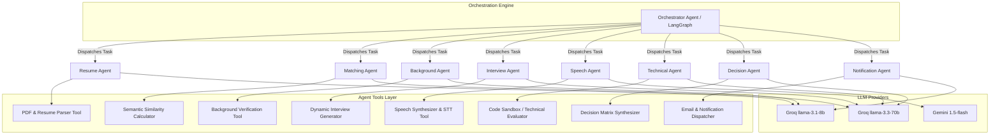
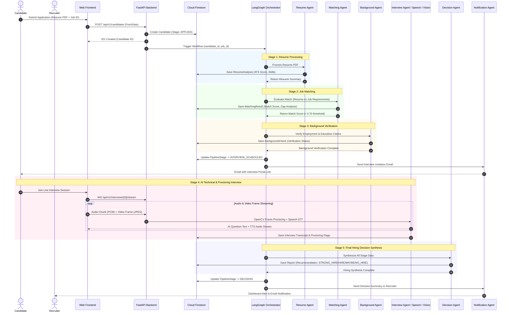

# TalentFlow-AI System Architecture

## 1. High-Level Architecture Overview

TalentFlow-AI is an autonomous, AI-native talent acquisition and recruitment platform. It leverages a microservices-inspired modular architecture with an async FastAPI backend, a multi-agent AI orchestration system driven by LangGraph, dual LLM infrastructure (Groq + Google Gemini), computer vision proctoring (OpenCV), and Firebase cloud infrastructure (Firestore, Auth, Storage).

```mermaid
flowchart TB
    subgraph Client Layer ["Client Layer"]
        WebUI["React + TypeScript Frontend\n(Tailwind CSS, Vite)"]
    end

    subgraph API Gateway ["FastAPI Gateway & Backend"]
        FastAPI["FastAPI App (app.py)"]
        CORSMw["CORS Middleware"]
        AuthMw["Firebase Auth Middleware"]
        TraceMw["Request Tracing (X-Request-ID)"]
        
        subgraph Controllers ["Controllers / Routes"]
            AuthCtrl["Auth Controller"]
            JobCtrl["Jobs Controller"]
            CandCtrl["Candidates Controller"]
            IntCtrl["Interviews Controller"]
            DashCtrl["Dashboard Controller"]
            RepCtrl["Reports Controller"]
        end

        subgraph Service Layer ["Services & Repositories"]
            Services["Business Logic Services"]
            Repos["Base & Domain Repositories"]
        end
    end

    subgraph Agent Infrastructure ["Multi-Agent AI System (agents/)"]
        Orchestrator["Orchestrator Agent\n(LangGraph State Machine)"]
        
        subgraph Specialized Agents ["Specialized AI Agents"]
            ResumeAgent["1. Resume Agent"]
            MatchingAgent["2. Matching Agent"]
            BGAgent["3. Background Agent"]
            InterviewAgent["4. Interview Agent"]
            SpeechAgent["5. Speech Agent"]
            TechAgent["6. Technical Agent"]
            DecisionAgent["7. Decision Agent"]
            NotifAgent["8. Notification Agent"]
        end

        ToolLayer["Shared Tool Layer (backend/tools/)"]
    end

    subgraph Computer Vision ["Real-time Proctoring Engine"]
        OpenCV["OpenCV Proctoring Engine\n(Face Detection, Eye Gaze, Audio Analytics)"]
    end

    subgraph LLM Providers ["LLM Infrastructure"]
        GroqLLM["Groq Cloud API\n(llama-3.3-70b, llama-3.1-8b)"]
        GeminiLLM["Google Gemini API\n(gemini-1.5-flash)"]
    end

    subgraph Firebase Cloud ["Firebase Infrastructure"]
        FirebaseAuth["Firebase Auth"]
        Firestore["Cloud Firestore\n(NoSQL Document Storage)"]
        FirebaseStorage["Firebase Storage\n(Resumes, Video/Audio Recordings)"]
    end

    %% Connections
    WebUI -->|HTTP / REST API| FastAPI
    WebUI -->|WebSocket (Real-time Stream)| IntCtrl
    
    FastAPI --> CORSMw --> AuthMw --> TraceMw --> Controllers
    Controllers --> Services --> Repos
    Repos -->|Firebase Admin SDK| Firestore
    
    Services --> Orchestrator
    Orchestrator --> Specialized Agents
    Specialized Agents --> ToolLayer
    
    ToolLayer --> GroqLLM
    ToolLayer --> GeminiLLM
    ToolLayer --> FirebaseStorage
    
    IntCtrl -->|Video Frames| OpenCV
    OpenCV -->|Proctoring Flags| IntCtrl
    
    AuthMw -->|Verify JWT| FirebaseAuth
```

---

## 2. Backend Architecture

The backend is built with **FastAPI** in Python 3.11+, following clean architecture principles with strict separation of concerns across controllers, services, repositories, and models.

```
backend/
├── app.py              # Application factory, lifespan, global middleware
├── main.py             # Uvicorn launcher
├── config.py           # Pydantic BaseSettings environment config
├── logger.py           # Structlog/standard structured logger with request context
├── middleware/         # Custom ASGI & HTTP middleware
├── controllers/        # REST & WebSocket endpoint handlers (Routers)
├── services/           # Core domain logic & agent invocation wiring
├── repositories/       # Firestore data access layer (Repository Pattern)
├── models/             # Pydantic domain models
├── schemas/            # Request / Response validation schemas
├── firebase/           # Admin SDK initialization & Firestore clients
├── shared/             # Shared helpers, constants, and Enums
├── templates/          # HTML/Email report templates
└── tools/              # Shared agent tool definitions
```

### Key Components

1. **FastAPI Application Factory (`backend/app.py`)**:
   - Manages application lifespan events (Firebase Admin SDK startup/shutdown).
   - Configures CORS middleware supporting configurable origins via `.env`.
   - Injects request context middleware for correlation IDs (`X-Request-ID`) across logs.

2. **Middleware Layer**:
   - `request_middleware`: Captures every inbound request, injects a unique UUID `request_id`, logs request metadata and execution latency, and attached diagnostic headers.
   - `auth_middleware`: Intercepts `Authorization: Bearer <token>` headers, validates Firebase ID Tokens using `firebase_admin.auth.verify_id_token()`, and populates `request.state.user`.

3. **Controllers / API Routers**:
   - Decouple routing from business logic. Endpoints validate incoming JSON/Form payloads against Pydantic schemas before delegating to Services.

4. **Service Layer (`backend/services/`)**:
   - Contains core business logic (candidate lifecycle progression, scoring algorithms, interview scheduling).
   - Coordinates execution of LangGraph workflows by invoking the Orchestrator.

5. **Repository Layer (`backend/repositories/`)**:
   - Implements the **Repository Pattern** over Cloud Firestore using `BaseRepository[T]`.
   - Provides CRUD operations, transactional updates, pagination, compound filter queries, and batch operations without leaking Firestore SDK details into domain services.

---

## 3. Agent Architecture

The AI layer is structured around 8 autonomous agents coordinated by a centralized **Orchestrator Agent**.



### Architectural Principles of Agents

1. **Tool-Mediated Side Effects**:
   - Agents **never** directly invoke external APIs, databases, or storage services.
   - All external interactions occur via explicit, sandboxed python functions in `backend/tools/`.

2. **Agent Registry & Base Classes**:
   - Every agent extends `BaseAgent` and registers itself with the central `AgentRegistry`.
   - Base agents enforce input validation, structured output parsing, error handling, and token budget tracking.

3. **Orchestrator State Machine (LangGraph)**:
   - Uses a stateful graph where nodes represent agent executions and edges represent conditional pipeline transitions based on candidate stage updates or evaluator scores.

4. **Dual LLM Strategy**:
   - **Groq `llama-3.1-8b`**: Used for lightweight extraction, deterministic tool selection, and rapid JSON parsing.
   - **Groq `llama-3.3-70b`**: Used for deep reasoning, interview evaluation, code review, and hiring decision synthesis.
   - **Google Gemini `1.5-flash`**: Used for multimodal analysis (resumes with complex layouts, visual interview recordings, long-context transcript analysis).

---

## 4. Data Flow Diagram

The diagram below details the end-to-end flow of a candidate application through the TalentFlow-AI pipeline:



---

## 5. Security Model

### 1. Authentication & Authorization
- **Authentication**: Authentication is handled via **Firebase Auth**. The backend validates ID Tokens (JWTs) using the Firebase Admin SDK on protected routes.
- **Role-Based Access Control (RBAC)**:
  - `admin`: Full system read/write access across all recruiters, candidates, jobs, and system settings.
  - `recruiter`: Access restricted to jobs created by their recruiter ID, candidates applied to their jobs, and associated interview reports.
  - `candidate`: Restricted strictly to their own profile, candidate application status, and active interview sessions.

### 2. Firestore Security Rules
- Granular Cloud Firestore rules enforce identity verification at the database level.
- Document ownership checks ensure candidates cannot view other applicants' scores, resumes, or interview recordings.

### 3. Media & File Storage Security
- Resumes and interview video streams are stored in private Firebase Storage buckets.
- Files are accessed exclusively via short-lived **Signed URLs** generated on-demand by the backend repository layer.

### 4. Secret Hygiene & Configuration Management
- Secrets (API Keys, Firebase Credentials, Private Keys) are injected exclusively via environment variables (`.env` file) managed by Pydantic's `BaseSettings` (`backend/config.py`).
- No hardcoded tokens, passwords, or credentials exist in source code.

### 5. Audit Logging & Tracing
- All requests are tagged with a unique `X-Request-ID` correlation header.
- Structured logs (`structlog`) capture timestamp, log level, request ID, endpoint path, duration, user ID, and exception tracebacks for full observability.
